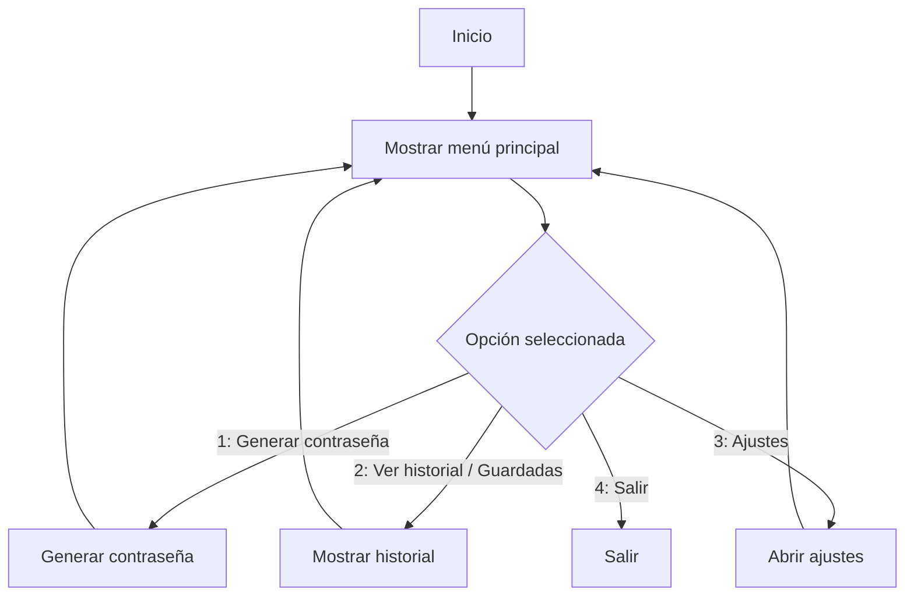

# Diagramas de flujo — Generador Seguro de Contraseñas

Este documento contiene **diagramas de flujo** en formato **Mermaid** listos para pegar o visualizar en GitHub (GitHub soporta Mermaid en .md). Incluye:

- Flujo principal (menú)
- Flujo de generación de contraseña
- Flujo de validación de parámetros
- Flujo de guardado/copiado

---

## Nota
Si tu visor no renderiza Mermaid, puedes copiar los bloques a un archivo `.md` en tu repositorio de GitHub y GitHub los mostrará correctamente.

---

## 1) Flujo principal (Menú)


---

## 2) Flujo: Generar contraseña
```mermaid
flowchart TD
  A[Iniciar generación] --> B[Solicitar parámetros]
  B --> C{Parámetros válidos?}
  C -->|No| D[Mostrar error y volver a pedir]
  C -->|Sí| E[Construir conjunto de caracteres]
  E --> F[Generar contraseña aleatoria (según longitud)]
  F --> G[Mostrar contraseña al usuario]
  G --> H{Desea guardar o copiar?}
  H -->|Copiar| I[Copiar al portapapeles]
  H -->|Guardar| J[Guardar en archivo/DB (opcional)]
  H -->|No| K[Volver al menú]
  I --> K
  J --> K
```

---

## 3) Flujo: Validación de parámetros
```mermaid
flowchart TD
  A[Recibir longitud y opciones] --> B[Comprobar longitud (entero)]
  B --> C{Dentro de rango 8..128?}
  C -->|No| D[Mostrar "longitud inválida"]
  C -->|Sí| E[Verificar que al menos un tipo de caracter esté seleccionado]
  E --> F{¿Al menos 1 tipo seleccionado?}
  F -->|No| G[Mostrar "seleccione al menos un tipo de caracter"]
  F -->|Sí| H[Parámetros válidos]
  D --> I[Volver a pedir parámetros]
  G --> I
  H --> J[Continuar generación]
```

---

## 4) Flujo: Guardar contraseña (opcional)
```mermaid
flowchart TD
  A[Solicitar confirmación de guardado] --> B{Guardar en texto plano o cifrado?}
  B -->|Texto plano| C[Escribir en archivo local (history.txt)]
  B -->|Cifrado| D[Solicitar contraseña maestra]
  D --> E[Cifrar contraseña generada]
  E --> F[Escribir en archivo cifrado (.enc)]
  C --> G[Confirmar guardado]
  F --> G
  G --> H[Volver al menú]
```

---

## Recomendaciones de implementación
- Usar generador aleatorio seguro (`secrets` en Python).  
- Evitar escribir contraseñas en texto plano si el proyecto va a persistir datos: mejor cifrar con `cryptography` o pedir una contraseña maestra.  
- Validar siempre la entrada del usuario para evitar errores.  
- Incluir comentarios en las funciones más complejas (generación y cifrado).

---

Si quieres, puedo:

- Convertir estos diagramas a imágenes PNG y subirlas al repositorio.  
- Generar los archivos `.md` y un README listo para GitHub con instrucciones para ejecutar el generador.

Dime qué prefieres y lo hago.

